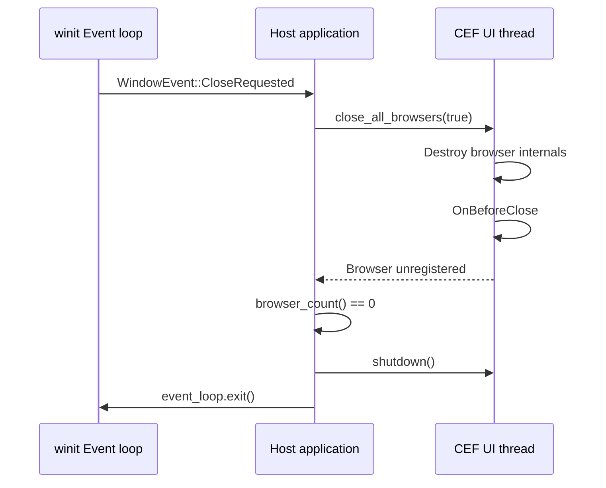
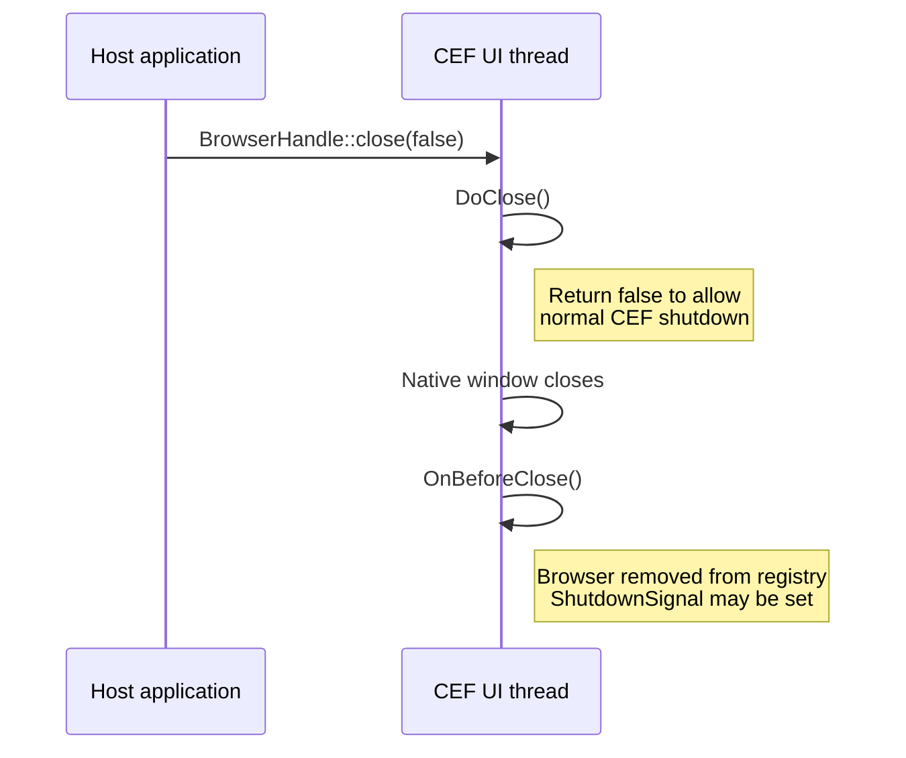
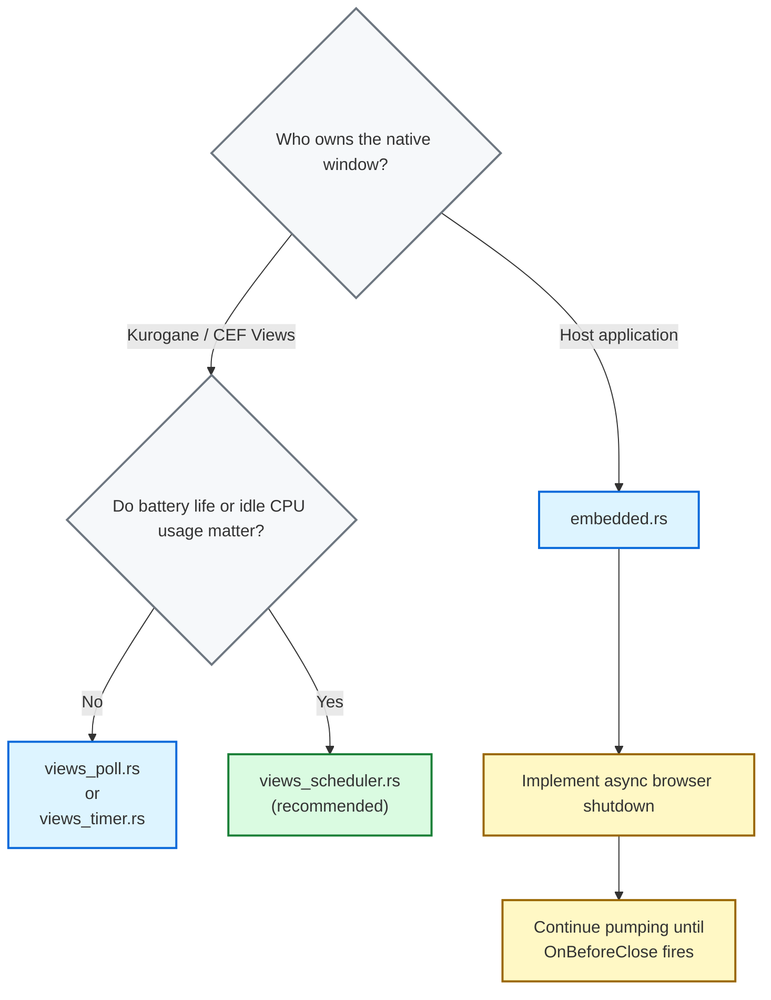

# Integration patterns for `winit`

Kurogane supports multiple event-loop integration strategies when embedding Chromium via [winit](https://docs.rs/winit/latest/winit/). Each strategy differs in how the host process drives the [CEF message loop](https://chromiumembedded.github.io/cef/general_usage#message-loop-integration), the mechanism by which Chromium's internal scheduler dispatches I/O completions, IPC messages and renderer tasks on the browser process's main thread.

> **Threading model.** CEF's browser-process main thread is a cooperative, single-threaded executor. It does not use a background pump thread. The host process is responsible for calling [`CefDoMessageLoopWork`](https://magpcss.org/ceforum/apidocs3/projects/(default)/(_globals).html#CefDoMessageLoopWork()) (or the equivalent [`RuntimeHandle::pump`](https://github.com/0x48piraj/kurogane/blob/86ce9810bcfa6b3b0d2f9a87f04907be7e799829/kurogane/src/runtime.rs#L491)) frequently enough that Chromium's internal timers and I/O completions are not starved. The strategies below differ only in *when* and *how often* the host elects to call this function.

## Strategy Comparison

| Example | [`ControlFlow`](https://docs.rs/winit/latest/winit/event_loop/enum.ControlFlow.html) mode | Pump cadence | Idle CPU | Complexity | When to use |
|---|---|---|---|---|---|
| [`views_poll.rs`](views_poll.rs) | `Poll` | Every loop iteration | Highest | Trivial | Quick debugging / experimentation |
| [`views_timer.rs`](views_timer.rs) | `WaitUntil` | Fixed 16 ms interval | Moderate | Low | Simple integrations without proxies |
| [`views_scheduler.rs`](views_scheduler.rs) | `Wait` + wakeup | On CEF scheduler callback | Lowest | Medium | Standard production apps (CEF Windows) |
| [`embedded.rs`](host_window.rs) | `Wait` + wakeup | On CEF scheduler callback | Lowest | Advanced | Custom windowing / embedding into existing UI |

> **Views vs. Embedded.** The first three examples use [CEF's Views framework](https://github.com/chromiumembedded/cef/tree/master/include/views), where `CefBrowserView` owns the native window. `embedded.rs` inverts this: the host creates the native window via `winit` and attaches Chromium as a child-window browser via [`CefWindowInfo::SetAsChild`](https://magpcss.org/ceforum/apidocs3/projects/(default)/CefWindowInfo.html). The event loop and window lifecycle semantics differ significantly between these two modes; see the native embedded integrator for details.

## Continuous polling loop _(aka the Brute-forcer)_

The minimal-viable integration. On every winit event-loop iteration, the host calls Kurogane's [`RuntimeHandle::pump`](https://github.com/0x48piraj/kurogane/blob/86ce9810bcfa6b3b0d2f9a87f04907be7e799829/kurogane/src/runtime.rs#L491) which in turn calls [`CefDoMessageLoopWork`](https://magpcss.org/ceforum/apidocs3/projects/(default)/(_globals).html#CefDoMessageLoopWork()) then immediately schedules the next iteration.

```rust
event_loop.run(move |event, _, control_flow| {
    *control_flow = ControlFlow::Poll;

    match event {
        Event::MainEventsCleared => {
            handle.pump();
        }
        // ...
    }
});
```

* **Cadence:** [`ControlFlow::Poll`](https://docs.rs/winit/latest/winit/event_loop/enum.ControlFlow.html#variant.Poll) executes every iteration. Kurogane is pumped continuously at an unbounded rate.
* **CPU profile:** Continuous 100% single-core saturation when idle. This matches the documented worst-case behavior of [`CefDoMessageLoopWork`](https://magpcss.org/ceforum/apidocs3/projects/(default)/(_globals).html#CefDoMessageLoopWork()).
* **Complexity:** No scheduler integration is required; Kurogane's `App::scheduler` callback is not invoked.

**Use when:** you want the minimum amount of code needed for disposable testing or debugging where performance profiling is not the objective.

## Fixed-interval timer loop _(aka the Clockwatcher)_

A fixed-interval pump using winit's [`ControlFlow::WaitUntil`](https://docs.rs/winit/latest/winit/event_loop/enum.ControlFlow.html#variant.WaitUntil). The host wakes every 16 ms (~60 Hz) and calls Kurogane's [`RuntimeHandle::pump`](https://github.com/0x48piraj/kurogane/blob/86ce9810bcfa6b3b0d2f9a87f04907be7e799829/kurogane/src/runtime.rs#L491), approximating the behaviour of a naïve `SetTimer`-based integration common in legacy Win32 CEF hosts.

```rust
const PUMP_INTERVAL: Duration = Duration::from_millis(16);

event_loop.run(move |event, _, control_flow| {
    *control_flow = ControlFlow::WaitUntil(Instant::now() + PUMP_INTERVAL);

    match event {
        Event::MainEventsCleared => {
            handle.pump();
        }
        // ...
    }
});
```

* **Cadence:** Driven by [`ControlFlow::WaitUntil`](https://docs.rs/winit/latest/winit/event_loop/enum.ControlFlow.html#variant.WaitUntil). Chromium is pumped at a fixed interval (~60Hz / 16ms), decoupled from `winit`'s native input/window event rate.
* **CPU profile:** Low-to-moderate constant baseline overhead. The runtime wakes and pumps even when the browser state is fully quiescent.
* **Complexity:** Minimal. Bypasses [`CefApp::OnScheduleMessagePumpWork`](https://cef-builds.spotifycdn.com/docs/108.4/classCefBrowserProcessHandler.html#a7ff7d1618399ede096ba16486a71d76e) / Kurogane's `App::scheduler`. The host dictates the clock, not Chromium.
* **Tuning trade-off:** 16 ms is a reasonable default. Increasing the interval (e.g., 100ms) drops CPU overhead further at the cost of perceptible jank in animated content.

**Use when:** you want a simple, timer-driven integration and are comfortable with a small constant idle-CPU cost. Appropriate for tools and utilities where absolute animation fidelity isn't a priority.

## Reactive event-driven loop _(aka the Caped crusader)_

The recommended integration for Views-mode deployments. Instead of a fixed timer, the host registers a scheduler callback via Kurogane's `App::scheduler`. CEF calls this callback whenever it has computed a deadline for its next required pump, derived from its internal [`base::MessageLoop`](https://source.chromium.org/chromium/chromium/src/+/main:base/message_loop/message_loop.h) timer queue. The host converts this deadline into a [`ControlFlow::WaitUntil`](https://docs.rs/winit/latest/winit/event_loop/enum.ControlFlow.html#variant.WaitUntil), allowing winit to sleep until either a native OS event or a CEF-requested wakeup occurs, whichever comes first.

```rust
App::builder()
    .scheduler(|delay: Option<Duration>| {
        // `delay` is None when CEF requests an immediate pump.
        // Post a wakeup to the winit event loop proxy.
        event_loop_proxy
            .send_event(AppEvent::PumpScheduled(delay))
            .ok();
    })
    .build()
```

```rust
// In the winit event handler:
Event::UserEvent(AppEvent::PumpScheduled(delay)) => {
    let deadline = Instant::now() + delay.unwrap_or(Duration::ZERO);
    *control_flow = ControlFlow::WaitUntil(deadline);
}
Event::MainEventsCleared => {
    handle.pump();
}
```

* **Cadence:** Purely reactive. Driven by [`CefApp::OnScheduleMessagePumpWork`](https://cef-builds.spotifycdn.com/docs/108.4/classCefBrowserProcessHandler.html#a7ff7d1618399ede096ba16486a71d76e) via Kurogane's `App::scheduler`. Chromium explicitly requests a pump from the browser-process UI thread only when delayed tasks or internal work are pending.
* **CPU profile:** Near-zero idle overhead. The host event loop sleeps indefinitely via [`ControlFlow::Wait`](https://docs.rs/winit/latest/winit/event_loop/enum.ControlFlow.html#variant.Wait) until awakened by an OS event or a Kurogane schedule request.
* **Active profile:** Dynamically scales. Automatically matches Chromium's internal work frequency (typically matching `requestAnimationFrame` up to ~60Hz or monitor refresh rate for rAF-driven content).
* **Threading Contract:** Kurogane's `App::scheduler` callback executes on the CEF UI thread. Crossing this boundary requires [`EventLoopProxy::send_event`](https://docs.rs/winit/latest/winit/event_loop/struct.EventLoopProxy.html) to thread-safely wake the `winit` event loop.

**Use when:** building a production application where resource optimization, battery life and frame-accurate animation fidelity are critical. This is the canonical integration pattern for host-managed event loops in CEF's own [documentation on external message pumps](https://chromiumembedded.github.io/cef/general_usage#message-loop-integration).

## Host-Managed Native Window Embedding _(aka the Mad scientist)_

The embedded integration inverts the Views ownership model. The host application creates a native OS window via winit, then attaches a Chromium browser as a child window using [`CefWindowInfo::SetAsChild`](https://magpcss.org/ceforum/apidocs3/projects/(default)/CefWindowInfo.html). The host retains complete ownership of the top-level window and is responsible for resizing and positioning the child browser surface.

```rust
let mut window_info = CefWindowInfo::new();
window_info.set_as_child(parent_hwnd, CefRect { x: 0, y: 0, width, height });

host.create_browser(
    &window_info,
    client.clone(),
    url,
    &browser_settings,
    None,
    None,
);
```

- **Cadence & CPU:** Reactive (identical to reactive event-driven loop). Driven by Kurogane's `App::scheduler` callbacks. Wakes on demand, near-zero idle CPU.
- **Window hierarchy:** The host process owns the window hierarchy. Chromium renders into a raw child surface (`HWND` / `NSView` / `XWindow`) of the `winit` window's native handle.
- **Layout contract:** Resize events must be forwarded to the browser via [`CefBrowserHost::WasResized`](https://magpcss.org/ceforum/apidocs3/projects/(default)/CefBrowserHost.html#WasResized()), which signals the renderer process to re-layout. Failure to call this will leave the browser surface clipped or stretched.

Because the host process owns the root window, teardown requires a coordinated multi-step asynchronous dance across the host thread and CEF UI thread.

The host application must not destroy the parent window handle or invoke the global CEF shutdown sequence until the following sequence has run to completion:

### Asynchronous shutdown sequence

The shutdown sequence for an embedded browser involves coordination across the browser process UI thread and the renderer process. Initiating shutdown with [`CefBrowserHost::CloseBrowser`](https://magpcss.org/ceforum/apidocs3/projects/(default)/CefBrowserHost.html#CloseBrowser(bool)) is only the first step.

#### Teardown state machine



#### CEF browser close lifecycle



> **Critical:** The host **must** continue calling Kurogane's [`RuntimeHandle::pump`](https://github.com/0x48piraj/kurogane/blob/86ce9810bcfa6b3b0d2f9a87f04907be7e799829/kurogane/src/runtime.rs#L491) after requesting browser closure. [`OnBeforeClose`](https://magpcss.org/ceforum/apidocs3/projects/(default)/CefLifeSpanHandler.html#OnBeforeClose) is dispatched from within [`CefDoMessageLoopWork`](https://magpcss.org/ceforum/apidocs3/projects/(default)/(_globals).html#CefDoMessageLoopWork()). If the host stops pumping, for example, by returning early from the event loop upon receiving a `CloseRequested` window event, [`OnBeforeClose`](https://magpcss.org/ceforum/apidocs3/projects/(default)/CefLifeSpanHandler.html#OnBeforeClose) will never fire and the `ShutdownSignal` will never be set. The process will hang.

The correct pattern is to decouple window-close intent from event-loop exit:

```rust
Event::WindowEvent { event: WindowEvent::CloseRequested, .. } => {
    // Do NOT exit the event loop here
    // Request browser closure and let CEF drive the shutdown sequence
    browser_handle.close(false);
}

Event::UserEvent(AppEvent::BrowserClosed) => {
    // OnBeforeClose has fired; it is now safe to exit
    *control_flow = ControlFlow::Exit;
}
```

**Use when:** you need Chromium as a composited component within an existing application UI e.g., rendering a web-based settings panel inside a native game or tool window. This is the most flexible integration but requires the host to correctly implement the asynchronous shutdown protocol end-to-end.

> **Fatal footgun:** [`OnBeforeClose`](https://magpcss.org/ceforum/apidocs3/projects/(default)/CefLifeSpanHandler.html#OnBeforeClose) is dispatched *from within* [`handle.pump()`](https://github.com/0x48piraj/kurogane/blob/86ce9810bcfa6b3b0d2f9a87f04907be7e799829/kurogane/src/runtime.rs#L491). If you call [`event_loop.exit()`](https://docs.rs/winit/latest/winit/event_loop/struct.EventLoop.html) immediately when `CloseRequested` fires, the loop stops pumping, CEF never fires its cleanup callbacks and the process will hang or leak dangling pointers.

## Choosing a strategy



## References

- [CEF general usage](https://chromiumembedded.github.io/cef/general_usage): Upstream architecture guide
- [LifeSpanHandler methods](https://magpcss.org/ceforum/apidocs3/projects/(default)/CefLifeSpanHandler.html): Browser creation and destruction lifecycle
